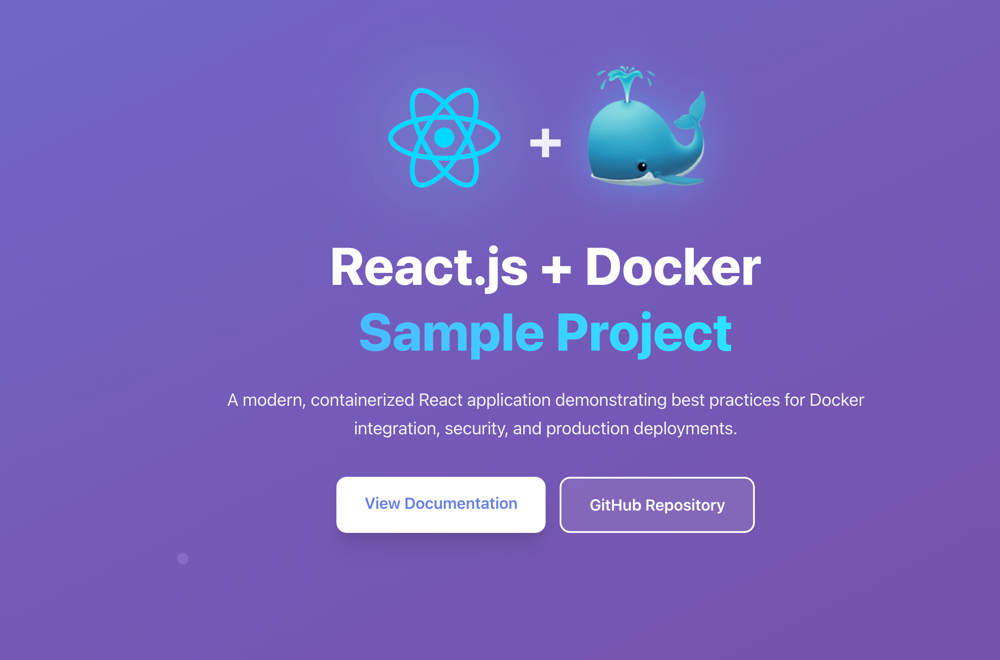

# 🐳 Docker React.js Sample Project

[](https://opensource.org/licenses/MIT)
[](https://www.docker.com/)
[](https://reactjs.org/)
[](https://www.typescriptlang.org/)
[](https://vitejs.dev/)

A comprehensive demonstration of containerizing a modern React.js application using Docker for both **development** and **production** workflows. This project showcases industry best practices for front-end containerization, including secure builds, streamlined development workflows, and optimized production delivery.

Part of the [official Docker React.js sample](https://docs.docker.com/guides/reactjs/) guide.

## 🚀 Demo

<div align="center">
  
</div>

## ✨ Features

- 🔥 **Modern React 19** with TypeScript
- ⚡ **Vite** for lightning-fast development
- 🎨 **Tailwind CSS** for utility-first styling
- 🐳 **Multi-stage Docker builds** for optimized production images
- 🔧 **Development & Production** Docker configurations
- 🧪 **Testing setup** with Vitest and Testing Library
- 📦 **Docker Compose** for easy orchestration
- ☸️ **Kubernetes deployment** configuration
- 🔒 **Security-focused** with vulnerability scanning
- 📋 **ESLint** for code quality
- 🤖 **Advanced CI/CD** with GitHub Actions ([see workflows](.github/WORKFLOWS.md))

## 🛠️ Tech Stack

- **Frontend**: React 19, TypeScript, Tailwind CSS
- **Build Tool**: Vite
- **Testing**: Vitest, React Testing Library
- **Containerization**: Docker, Docker Compose
- **Orchestration**: Kubernetes (optional)
- **Web Server**: Nginx (production)

## 📋 Prerequisites

- [Docker](https://www.docker.com/get-started) (v20.10+)
- [Docker Compose](https://docs.docker.com/compose/install/) (v2.0+)
- [Node.js](https://nodejs.org/) (v24+) - for local development
- [npm](https://www.npmjs.com/) or [yarn](https://yarnpkg.com/) - for local development

## 🚀 Quick Start

### Using Docker (Recommended)

1. **Clone the repository**

   ```bash
   git clone https://github.com/kristiyan-velkov/docker-reactjs-sample.git
   cd docker-reactjs-sample
   ```

2. **Development with Docker Compose**

   ```bash
   docker compose up --build
   ```

   Access the app at [http://localhost:3000](http://localhost:3000)

3. **Production build**
   ```bash
   docker build -t react-docker-app .
   docker run -p 8080:80 react-docker-app
   ```
   Access the app at [http://localhost:8080](http://localhost:8080)

### Local Development

1. **Install dependencies**

   ```bash
   npm install
   ```

2. **Start development server**

   ```bash
   npm run dev
   ```

3. **Run tests**

   ```bash
   npm test
   ```

4. **Build for production**
   ```bash
   npm run build
   ```

## 🐳 Docker Commands

### Development

```bash
# Build development image
docker build -f Dockerfile.dev -t react-app-dev .

# Run development container
docker run -p 3000:3000 -v $(pwd):/app react-app-dev

# Using Docker Compose (recommended)
docker compose up --build
```

### Production

```bash
# Build production image
docker build -t react-app-prod .

# Run production container
docker run -p 8080:80 react-app-prod

# Multi-platform build
docker buildx build --platform linux/amd64,linux/arm64 -t react-app .
```

## ☸️ Kubernetes Deployment

Deploy to Kubernetes using the provided configuration:

```bash
kubectl apply -f reactjs-sample-kubernetes.yaml
```

This creates:

- Deployment with 3 replicas
- Service (LoadBalancer)
- ConfigMap for Nginx configuration

## 📁 Project Structure

```
├── public/                 # Static assets
├── src/                   # Source code
│   ├── components/        # React components
│   ├── index.css         # Global styles
│   └── main.tsx          # Application entry point
├── images/               # Documentation images
├── Dockerfile            # Production Docker configuration
├── Dockerfile.dev        # Development Docker configuration
├── compose.yaml          # Docker Compose configuration
├── nginx.conf           # Nginx configuration for production
├── reactjs-sample-kubernetes.yaml  # Kubernetes deployment
└── Taskfile.yml         # Task automation
```

## 🧪 Testing

Run the test suite:

```bash
# Local testing
npm run test

# Testing in Docker
docker compose exec app npm run test
```

## 🛡️ Security

This Docker image has been thoroughly scanned for vulnerabilities using Docker Scout and other security tools. The image passes all vulnerability assessments and follows security best practices:

- Non-root user execution
- Minimal base images (Alpine Linux)
- Regular dependency updates
- Security-focused Nginx configuration

<div align="center">
  
</div>

## 🔧 Configuration

### Environment Variables

| Variable   | Description      | Default       |
| ---------- | ---------------- | ------------- |
| `PORT`     | Application port | `3000`        |
| `NODE_ENV` | Environment mode | `development` |

### Docker Compose Override

Create a `compose.override.yaml` file for local customizations:

```yaml
services:
  app:
    ports:
      - "3001:3000" # Use different port
    environment:
      - CUSTOM_VAR=value
```

## 📚 Available Scripts

| Command           | Description              |
| ----------------- | ------------------------ |
| `npm run dev`     | Start development server |
| `npm run build`   | Build for production     |
| `npm run preview` | Preview production build |
| `npm run lint`    | Run ESLint               |
| `npm test`        | Run tests                |

## 🤝 Contributing

Contributions are welcome! Please feel free to submit a Pull Request. For major changes, please open an issue first to discuss what you would like to change.

1. Fork the repository
2. Create your feature branch (`git checkout -b feature/AmazingFeature`)
3. Commit your changes (`git commit -m 'Add some AmazingFeature'`)
4. Push to the branch (`git push origin feature/AmazingFeature`)
5. Open a Pull Request

## 📝 License

This project is licensed under the MIT License - see the [LICENSE](LICENSE) file for details.

## 👨‍💻 Author

**Kristiyan Velkov**

- LinkedIn: [kristiyan-velkov](https://www.linkedin.com/in/kristiyan-velkov-763130b3/)
- Medium: [@kristiyanvelkov](https://medium.com/@kristiyanvelkov)
- Newsletter: [Front-end World](https://kristiyanvelkov.substack.com)

## ☕ Support

If you find this project helpful, consider supporting my work:

- [GitHub Sponsors](https://github.com/sponsors/kristiyan-velkov)
- [Buy Me a Coffee](https://www.buymeacoffee.com/kristiyanvelkov)
- [Revolut](https://revolut.me/kristiyanvelkov)

Your support helps me continue creating valuable content for the community! 🚀

## 🔗 Related Resources

- [Docker Documentation](https://docs.docker.com/)
- [React Documentation](https://react.dev/)
- [Vite Documentation](https://vitejs.dev/)
- [Tailwind CSS Documentation](https://tailwindcss.com/)
- [Docker React.js Guide](https://docs.docker.com/guides/reactjs/)
